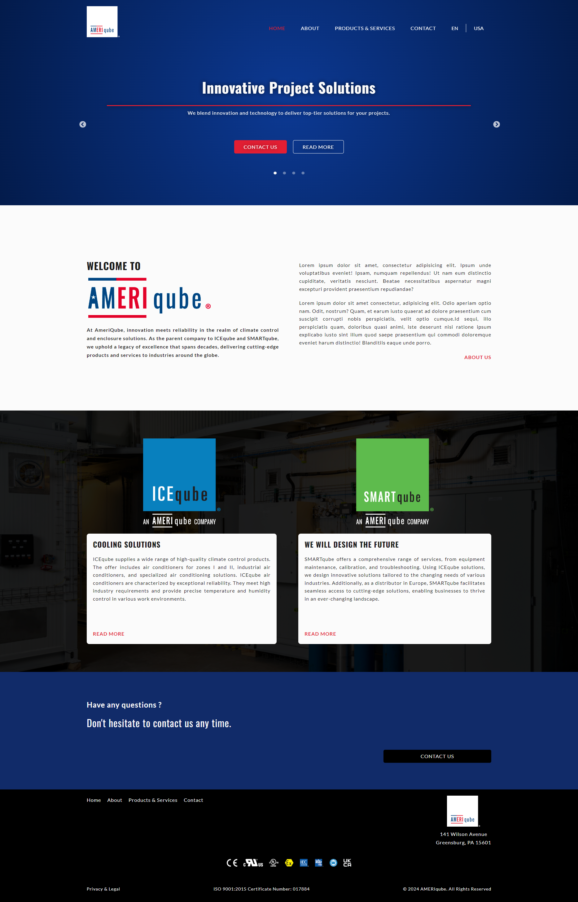

# :construction_worker: AMERIqube

Ameriqube Company is headquartered in Pennsylvania, United States, and serves as the parent company for IceQube and Smart Qube. This application is designed to support and streamline the operations for Ameriqube and its subsidiaries, leveraging innovative solutions to enhance business processes and engagement.


**Live demo:** 
[](https://ameriqubeapp.vercel.app/)
[live](https://ameriqubeapp.vercel.app/) 

## :bear: Resources

**Github frontend:** https://github.com/OllaWilk/ameriqubeapp 

## :cow: Tech Stack


## :camel: Project structure

```
ameriqubeapp
├── public
│   ├── logos
│   ├── video
│   ├── favicon.ico
│   ├── index.html
│   ├── logo192.png
│   ├── logo512.png
│   ├── manifest.json
│   ├── robots.txt
│   └── screenshot.png
├── src
│   ├── components
│   ├── context
│   ├── i18n
│   ├── img
│   ├── layout
│   ├── styles
│   ├── types
│   ├── utils
│   ├── views
│   ├── App.tsx
│   ├── config.env.ts
│   ├── index.tsx
│   ├── react-app-env.d.ts
│   ├── react-slick.d.ts
│   ├── reportWebVitals.ts
│   ├── setupTests.ts
│   └── video-type.d.ts
├── .eslintrc
├── .gitignore
├── .npmrc
├── package-lock.json
├── package.json
├── README.md
└── tsconfig.json

```

## 🦋 Branch Naming Conventions

In my project, I follow a consistent branch naming convention to ensure clarity and organization. Here are the standard branch names and their purposes:

1. **Main Branch**

   - **`main`**: The primary branch that always contains the stable version of the application.

2. **Development Branch**

   - **`develop`**: Branch for integrating new features and fixes before merging them into the main branch.

3. **Feature Branches**

   - Use the prefix `feature/`:

4. **Bugfix Branches**

   - Use the prefix `fix/`:

5. **Refactor Branches**

   - Use the prefix `refactor/`:

6. **Test Branches**

   - Use the prefix `test/`:

7. **Documentation Branches**

   - Use the prefix `docs/`:

## :dragon_face: Installation project

**Clone the project:**

```
git clone https://github.com/OllaWilk/ameriqubeapp.git
```

**Go to the project directory:**

```
cd ameriqubeapp
```

**Install dependencies:**

```
npm install
```

**Start the server:**

```
npm run start
```
